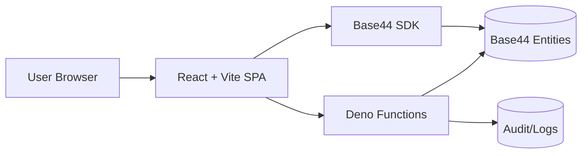
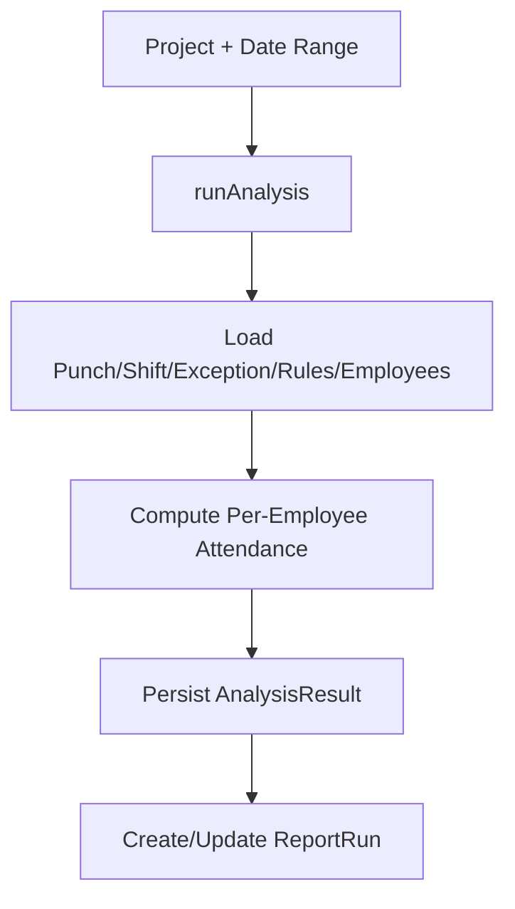
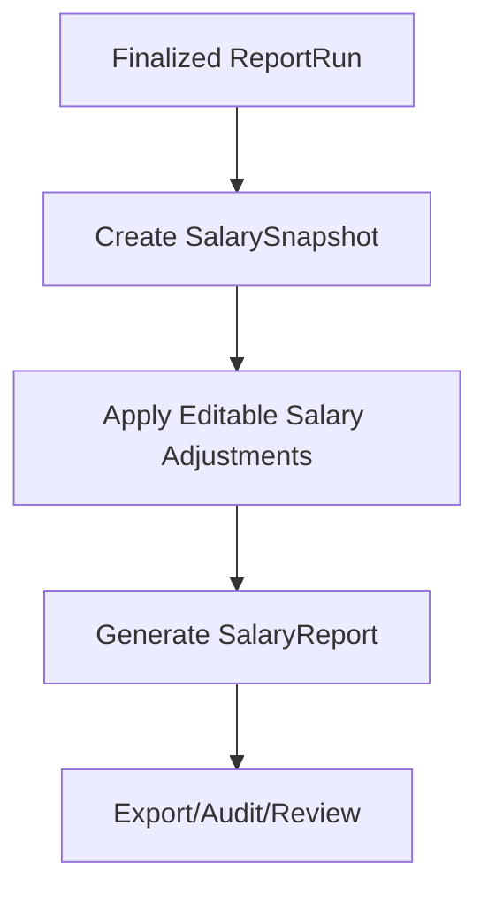

# Attendance Analyzer — Architecture Documentation

## 1) Purpose and Scope

This document describes the architecture of the attendance analyzer and payroll processing platform in this repository. It covers:

- Frontend application structure (`src/`)
- Backend function layer (`functions/`)
- Security and access control model
- Entity model overview
- Core business workflows
- Operational/maintenance patterns

The goal is to give maintainers a practical map of how the system is organized and where to make changes safely.

---

## 2) System Overview

This is a **Base44-backed, React single-page application** for multi-company attendance and payroll operations.

At a high level:

1. Users authenticate through Base44 auth.
2. The frontend loads role-aware navigation and page permissions.
3. Attendance and payroll actions call Base44 entities and custom Deno functions.
4. Analysis and salary data are persisted as entities (`AnalysisResult`, `ReportRun`, `SalarySnapshot`, etc.).
5. Operational support functions provide recalculation, migration, reconciliation, and audit capabilities.

### High-level runtime flow

---

## 3) Technology Stack

### Frontend

- **Vite** build tool with `@vitejs/plugin-react`
- **React 18** + **React Router v6**
- **TanStack Query** for server state/caching
- **Tailwind CSS** + custom UI components (Radix-inspired primitives)
- `@base44/sdk` for auth/entity/function communication

### Backend function layer

- **Deno-based serverless handlers** in `functions/*.ts`
- `createClientFromRequest` from Base44 SDK for user + service-role access

### Data platform

- Base44 entities (dozens of domain tables, e.g. `Project`, `Employee`, `Punch`, `AnalysisResult`, `SalarySnapshot`, `AuditLog`)

---

## 3.1 Critical Rules for External Developers and AI Agents

This section is a **mandatory pre-change checklist**. If ignored, changes can break core platform behavior.

### Never touch these without platform-level reason

- `index.html` — platform-managed entrypoint; do not edit for regular feature work.
- `index.css` — base shadcn/ui theme layer; edits can cascade across the entire app.
- `tailwind.config.js` — platform-aligned configuration; changes may not apply as expected in hosted runtime.
- `src/lib/` internals — treat as platform internals. Only customize `PageNotFound.jsx` when intentionally changing 404 behavior.
- `@/api/base44Client` — pre-initialized Base44 SDK client; never recreate or replace with a custom client.
- `src/components/ui/*` (shadcn primitives) — avoid editing unless absolutely necessary and impact is fully assessed.
- Authentication/login pages — do not create custom login/signup flows; auth is platform-managed.
- App routing ownership in `App.jsx` — routing is platform-generated from `pages/` and should not be manually re-wired.

### File-structure and deployment rules

- Pages must remain flat: `pages/MyPage.jsx` ✅, nested `pages/admin/MyPage.jsx` ❌.
- Components may have subfolders: `components/dashboard/Chart.jsx` ✅.
- Entity files are full schemas: `entities/MyEntity.json` must include the **entire schema** (never partial field edits only).
- Functions are isolated Deno handlers (`functions/*.ts` / `functions/*.js`): no local imports between function files.
- Function names must use camelCase (no spaces/hyphens/slashes).

### SDK and security rules

- Frontend SDK usage: `import { base44 } from '@/api/base44Client'` only.
- Backend function client: `import { createClientFromRequest } from 'npm:@base44/sdk@0.8.6'`.
- Never expose API keys/tokens in frontend.
- Never use `base44.asServiceRole` in frontend code (backend-only).

### Layout and navigation rules

- `Layout` receives `children` and `currentPageName`; do not import and embed `Layout` inside pages.
- Use `createPageUrl('PageName')` for navigation; avoid hardcoded paths when internal navigation helpers are available.
- Do not modify `Layout` to import pages directly; page rendering must stay via `children`.

### Common pitfalls to check before merge

- **Invalid hook call / white screen**: caused by duplicate React runtime paths, incorrect React wiring, or hook misuse.
- **Infinite loops**: unstable `useEffect` dependencies (inline objects/arrays/functions) or incorrect React Query dependency behavior.
- **Broken navigation**: manual route/layout rewiring that bypasses platform patterns.
- **Entity data loss**: partial schema updates to entity JSON files.
- **Function runtime failures**: cross-function local imports, or missing `npm:` package specifiers in Deno handlers.
- **UI crash from icons**: use only valid `lucide-react` icon names.

### What is safe to edit

- `src/pages/*.jsx`
- `src/components/**/*.jsx`
- `functions/*.ts` / `functions/*.js`
- `entities/*.json` (full schema updates only)
- `agents/*.json`
- `src/globals.css`
- `src/Layout.jsx` (with caution and preserving platform contracts above)

### Package policy

- Prefer pre-installed ecosystem packages already used in this app (React, Tailwind, shadcn, lucide-react, recharts, date-fns, lodash, framer-motion, three, react-leaflet, @hello-pangea/dnd, @tanstack/react-query, etc.).
- Do not add arbitrary packages without verifying platform support and runtime compatibility first.

---

## 4) Frontend Architecture

## 4.1 Bootstrapping and App Shell

Primary bootstrap sequence:

1. `src/main.jsx` renders `<App />`.
2. `src/App.jsx` wraps the app with:
   - `AuthProvider`
   - `QueryClientProvider`
   - `BrowserRouter`
3. `AuthenticatedApp` blocks rendering until public settings and auth state are resolved.
4. Routes are generated from `pages.config.js` and wrapped with `Layout`.

### Router strategy

- Root route (`/`) renders `mainPage` from `pages.config.js`.
- All pages in `PAGES` are mounted as `/<PageName>` routes.
- Unknown routes go to `PageNotFound`.

## 4.2 Layout and Navigation

`src/Layout.jsx` is the main shell and centralizes:

- Permission-aware navigation assembly (desktop + mobile)
- Global maintenance mode handling
- Role-based landing redirects (e.g., department head/HR flows)
- Company branding runtime CSS variables
- Notification center and global toasts
- Company switch shortcut for privileged roles

Navigation metadata is defined in `src/components/config/pagesConfig.jsx`:

- category + ordering
- role defaults
- nav visibility
- special route metadata (e.g., smart route behavior)

## 4.3 Authentication and Session Initialization

`src/lib/AuthContext.jsx` provides app-level auth lifecycle:

- Fetches app public settings first (to determine auth constraints)
- Validates user session if token exists
- Emits explicit app states:
  - loading
  - auth required
  - user not registered
  - authenticated

`src/lib/app-params.js` reads runtime parameters from URL/local storage:

- `app_id`
- `server_url`
- `access_token`
- `functions_version`

This allows hosted embedding and token handoff without hardcoded environment-only behavior.

## 4.4 Authorization (Frontend)

`usePermissions` hook (`src/components/hooks/usePermissions.jsx`) combines:

- Current user role (`extended_role` fallback to `role`)
- Dynamic page permissions (`PagePermission` entity)
- Static page configuration defaults

Behavioral notes:

- Page visibility in nav depends on permission records, not only static config.
- Session activity logs are recorded once per session.

## 4.5 Data Access Pattern

The app uses Base44 entity methods throughout pages/components. A dedicated helper (`src/components/utils/dataAccessHelpers.jsx`) defines a critical governance rule:

> Never rely on implicit `.filter()` defaults; always specify limits or use paginated fetch patterns.

This exists to prevent silent truncation in payroll/attendance datasets.

---

## 5) Backend Function Architecture

The `functions/` folder contains 80+ handlers. These are not only feature APIs; they also include operational repair/migration tooling.

### 5.1 Function categories

- **Core processing**: `runAnalysis`, `createSalarySnapshots`, `resolveSalaryForMonth`, `runCalendarPayrollPreview`
- **Finalization/report lifecycle**: `markFinalReport`, `unfinalizeReport`, `adminFinalizeReport`, `regenerateSalaryReport`
- **Recalculation utilities**: multiple `recalculate*` functions
- **Data quality repair**: `fix*`, `repair*`, `findAndFix*` functions
- **Migration/bootstrap**: `migrate*`, `initializeQuarterForCompany`, `syncExistingCompanies`
- **Governance/audit/security**: `securityAudit`, `validateSecureAccess`, `logAudit`, `audit*`

### 5.2 Core analysis flow (`runAnalysis`)

`runAnalysis.ts` is a central workflow function:

1. Authenticate user.
2. Validate required payload (`project_id`, date range).
3. Optionally continue/update an existing report run.
4. Load project and enforce role/company access checks.
5. Fetch dependent datasets (punches, shifts, exceptions, employees, rules, project overrides, Ramadan schedules).
6. Build filtered employee scope (including project-level overrides).
7. Create/update `ReportRun` with analyzed employee count.
8. Execute attendance computation logic and persist analysis outputs.

The function includes multiple domain-specific safeguards and bug-fix comments, indicating it is a key source of business correctness.

---

## 6) Domain Model Overview (Inferred)

## 6.1 Core attendance entities

- `Project`
- `Punch`
- `ShiftTiming`
- `Exception`
- `AttendanceRules`
- `AnalysisResult`
- `ReportRun`

## 6.2 Payroll entities

- `EmployeeSalary`
- `SalarySnapshot`
- `SalaryReport`
- `SalaryIncrement`
- `OvertimeData`

## 6.3 Organizational entities

- `Company`
- `CompanySettings`
- `Employee`
- `DepartmentHead`
- `User`
- `PagePermission`

## 6.4 Calendar/allowance entities

- `CalendarCycle`
- `CalendarCarryoverBucket`
- `CalendarPayrollSnapshot`
- `CalendarEmployeeMonthlySummary`
- `EmployeeQuarterlyMinutes`
- `EmployeeGraceHistory`

## 6.5 Governance/support entities

- `AuditLog`
- `ActivityLog`
- `SystemSettings`
- `ChecklistItem`
- `FeatureRequest`
- `AppDocument`

---

## 7) Access Control Architecture

Access control is implemented in layers:

1. **UI/Navigation layer**
   - Page discoverability controlled by `PagePermission` and role checks.
2. **Page/feature logic layer**
   - Components apply role/company/department constraints for data rendering and actions.
3. **Function/API layer**
   - Functions validate authenticated user and enforce operation-specific rules.
   - `validateSecureAccess` provides entity-operation policy checks for role + scope.
4. **Auditability**
   - Security and activity actions are logged into dedicated entities.

This layered approach is appropriate for enterprise payroll systems where UI hiding alone is insufficient.

---

## 8) Key Business Workflows

## 8.1 Attendance analysis lifecycle

## 8.2 Salary generation lifecycle (conceptual)

Business rules currently enforced in salary flows:

- Salary report UI groups **additions first** and **deductions next**, with explicit `Net Additions` and `Net Deductions` columns for review clarity.
- Overtime hours in salary report views are read-only and should come from overtime/adjustment workflows (not direct salary-table editing).
- Snapshot calculation rule: if both overtime pay and incentive exist, pay **only the higher** amount (not both).
- Bonus is added as entered (no forced pre-rounding), while aggregated net deductions are rounded to 2 decimals before totaling.

## 8.3 Operational correction lifecycle

When inconsistencies appear (mismatch, missing snapshots, invalid IDs):

1. Run diagnostic/audit functions.
2. Apply targeted `fix*` or `recalculate*` function.
3. Regenerate report/snapshots if needed.
4. Re-verify with integrity/audit functions.

---

## 9) Operational & Reliability Characteristics

### Strengths

- Broad role support (`admin`, `ceo`, `supervisor`, `user`, `department_head`, `hr_manager`)
- Rich function toolbox for recovery and migration
- Explicit data-integrity caution around query limits
- Embedded documentation pages and internal technical content

### Risks / Technical debt

- High number of operational functions increases discoverability burden
- Large, logic-dense files (especially analysis/salary flows) are harder to reason about
- Possible duplication of authorization assumptions between frontend and function layer
- Domain correctness depends on disciplined use of snapshot/finalization rules

---

## 10) Recommended Structural Improvements

1. **Function domain packaging**
   - Group related function logic into shared domain modules (analysis, salary, audits).
2. **Typed contracts**
   - Introduce shared schema validation for function payloads and key entities.
3. **Architecture decision records (ADR)**
   - Capture decisions about finalization immutability and report/snapshot source-of-truth.
4. **Permission matrix source-of-truth**
   - Generate docs/tests from a single role-entity-operation matrix.
5. **Data access linting**
   - Add CI checks for unsafe `.filter()` usage without limits.
6. **Workflow diagrams in docs/**
   - Expand this file into sub-docs for analysis, salary, and quarterly minutes systems.

---

## 11) Repository Landmarks

- Frontend bootstrap: `src/main.jsx`, `src/App.jsx`
- Router registration: `src/pages.config.js`
- App shell: `src/Layout.jsx`
- Auth: `src/lib/AuthContext.jsx`, `src/lib/app-params.js`
- Permissions: `src/components/config/pagesConfig.jsx`, `src/components/hooks/usePermissions.jsx`
- Data safety helper: `src/components/utils/dataAccessHelpers.jsx`
- Core backend analysis: `functions/runAnalysis.ts`
- Security policy check: `functions/validateSecureAccess.ts`

---

## 12) Change Management Guidance

When implementing new features:

1. Add/adjust page metadata in page config if UI surface is needed.
2. Verify role access in both UI and function layer.
3. Use explicit query limits for entity reads.
4. Prefer extending existing domain workflows over adding isolated ad-hoc functions.
5. Add audit logs for sensitive payroll-affecting operations.

When modifying salary or attendance calculations:

- Treat finalized snapshots/results as immutable source-of-truth unless performing controlled regeneration.
- Ensure correction functions are idempotent and traceable.
- Validate with reconciliation/audit functions before and after change.
